# Power BI Retail Analytics

End-to-end Power BI retail analytics project designed to support management decision-making across sales, profitability, customers, inventory and supply, marketing, forecasting, and scenario analysis.

The solution combines interactive dashboards, dynamic KPI analysis, drill-down analysis, forecasting models, and what-if scenarios in a single Power BI report.

---

## Project Overview

The project was developed as a comprehensive retail analytics solution rather than a collection of separate dashboards.

The report enables users to move from a high-level management overview to detailed analysis of business performance and the factors driving changes in results.

The main analytical areas are:

- Executive Summary
- Sales Analysis
- Profitability Analysis
- Customer Analysis
- Inventory & Supply Analysis
- Marketing Analysis
- Forecasting & Scenario Analysis

The report interface is in Lithuanian, while the data model and DAX structure use English naming conventions.

---

## Executive Summary

The Executive Summary provides a high-level overview of the most important business KPIs:

- Revenue
- Gross Profit
- Gross Margin
- Units Sold
- Revenue Budget Achievement
- Gross Profit Budget Achievement

Performance is compared with both the previous year and budget.

Dynamic insights summarize the most important changes and help identify areas that require further analysis.

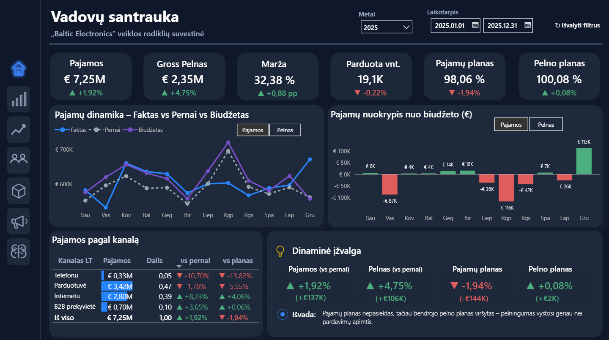

---

## Sales Analysis

The Sales Analysis page focuses on revenue performance and the main drivers behind year-over-year and budget deviations.

Key metrics include:

- Revenue
- Units Sold
- Average Selling Price
- Orders
- Average Basket Value
- Revenue Budget Achievement

Price, volume, and product mix effects are used to explain changes in revenue.

The analysis can be expanded through an interactive decomposition tree from sales channel to:

**Channel → Country → City → Store → Category → Subcategory → Product**

This allows the user to move from the overall revenue result to the specific business area or product responsible for the change.

The analysis supports comparison against both:

- Previous Year
- Budget

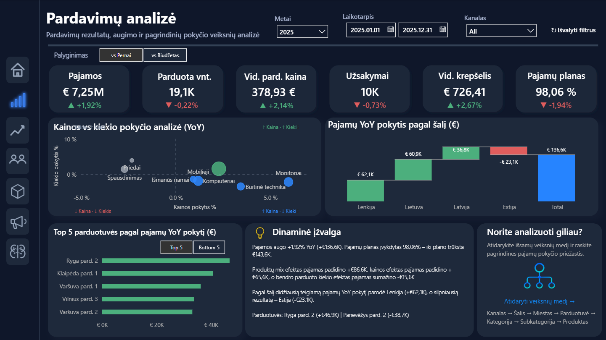

### Sales Driver Analysis – Year over Year

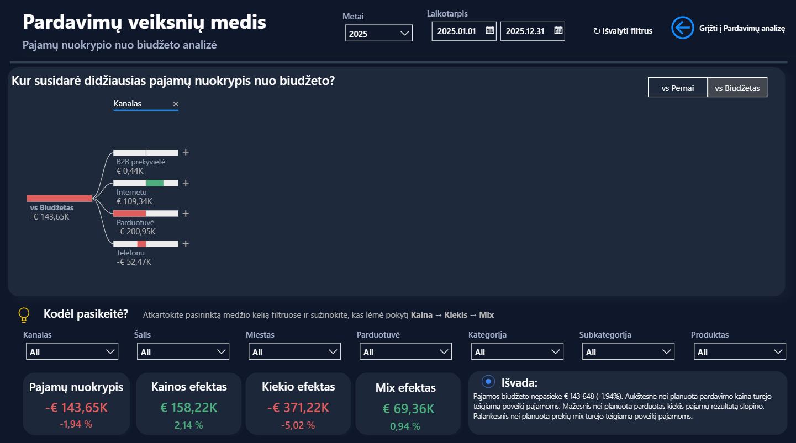

### Sales Driver Analysis – Budget

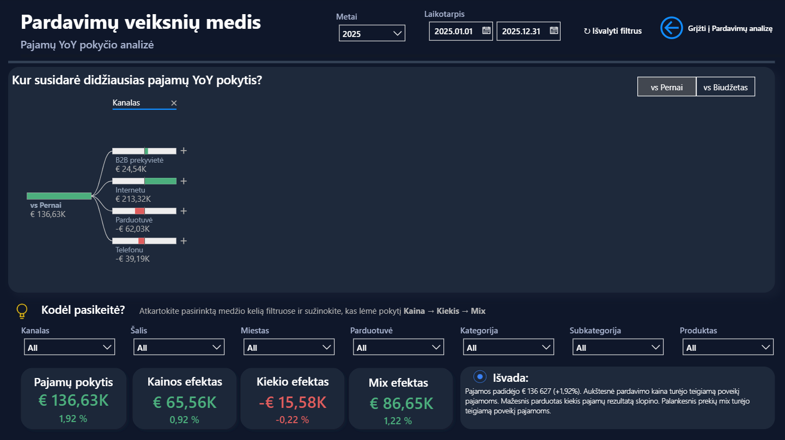

---

## Profitability Analysis

The Profitability Analysis page evaluates business performance from both gross profit and contribution profit perspectives.

Key metrics include:

- Gross Profit
- Gross Margin
- Contribution Profit
- Contribution Margin
- Gross Profit Budget Achievement
- Additional Costs

The report also shows the profit formation structure:

**Revenue → COGS → Gross Profit → Delivery Costs → Payment Fees → Contribution Profit**

An interactive decomposition tree enables deeper analysis of Gross Profit changes and budget deviations through:

**Channel → Country → City → Store → Category → Subcategory → Product**

This helps identify where profitability improved or deteriorated and whether the change was driven by revenue, cost, or margin performance.

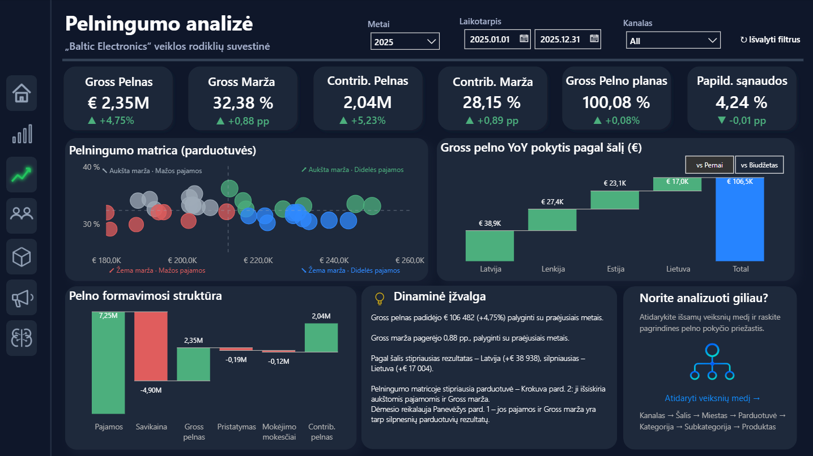

### Gross Profit Driver Analysis – Year over Year

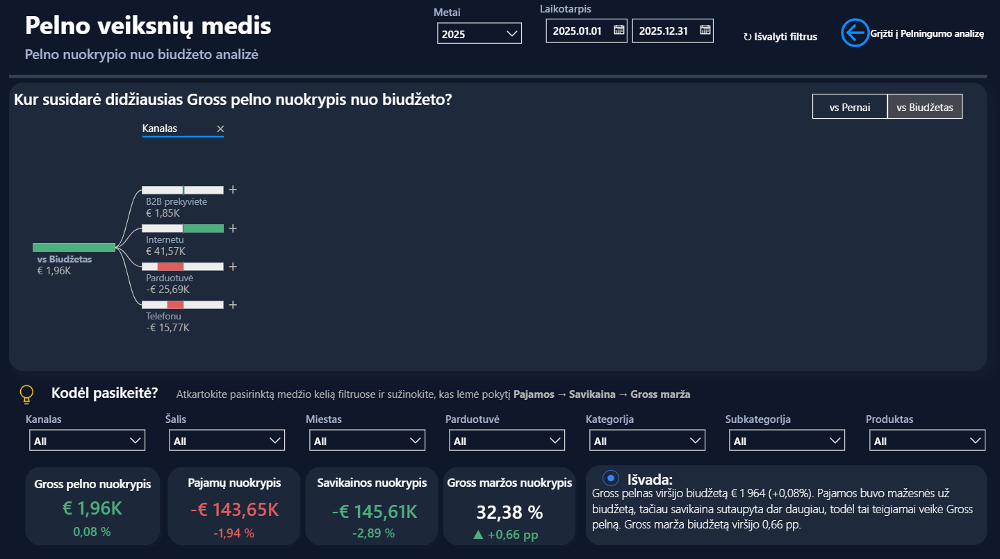

### Gross Profit Driver Analysis – Budget

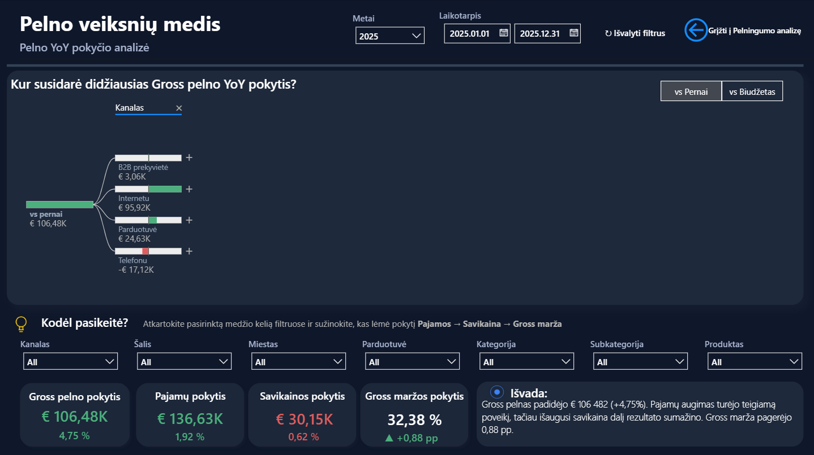

---

## Customer Analysis

The Customer Analysis section focuses on customer base development, customer value, retention, and segmentation.

Key metrics include:

- Active Customers
- New Customers
- Revenue per Customer
- Orders per Customer
- Average Basket Value
- Gross Profit per Customer

The analysis includes new vs returning customers, customer value distribution, and revenue by customer segment.

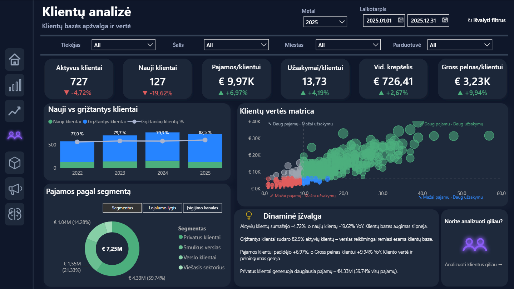

A dedicated Customer Lifecycle page extends the analysis with:

- RFM segmentation
- Customer value classification
- Cohort retention analysis
- Individual customer-level analysis

RFM segments can be combined with customer value levels to filter the customer base and move down to individual customers.

This makes it possible to identify, for example, high-value loyal customers that should be retained, customers requiring attention, and customers at risk of becoming inactive.

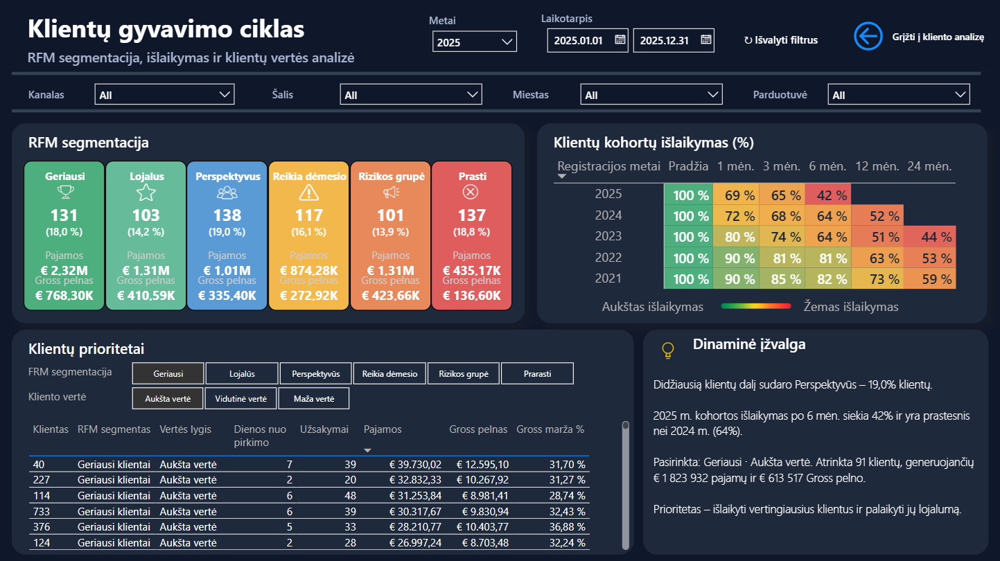

---

## Inventory & Supply Analysis

The Inventory & Supply Analysis page evaluates whether inventory levels are appropriate and whether suppliers support timely replenishment.

Key metrics include:

- Inventory Value
- Out-of-Stock SKUs
- Excess Inventory SKUs
- Supplier On-Time Delivery Rate
- Average Supplier Delivery Time
- Defect Rate

Products are classified into inventory risk groups based on stock levels and sales velocity.

The analysis helps identify:

- Stock shortage risk
- Excess inventory
- Slow-moving products
- Supplier delivery issues
- Potential capital tied up in inventory

Detailed product and supplier information supports operational decision-making.

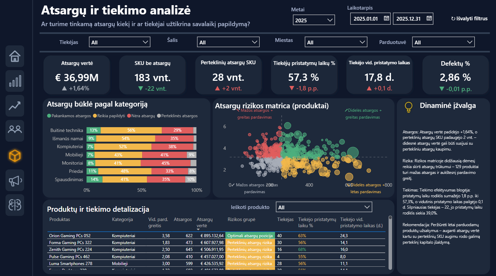

---

## Marketing Analysis

The Marketing Analysis section evaluates marketing efficiency across channels and campaigns.

Key metrics include:

- Marketing Spend
- Attributed Revenue
- Attributed Gross Profit
- Marketing ROI
- ROAS
- Conversions
- CTR
- Conversion Rate

The marketing funnel tracks performance from:

**Impressions → Clicks → Conversions → Attributed Revenue**

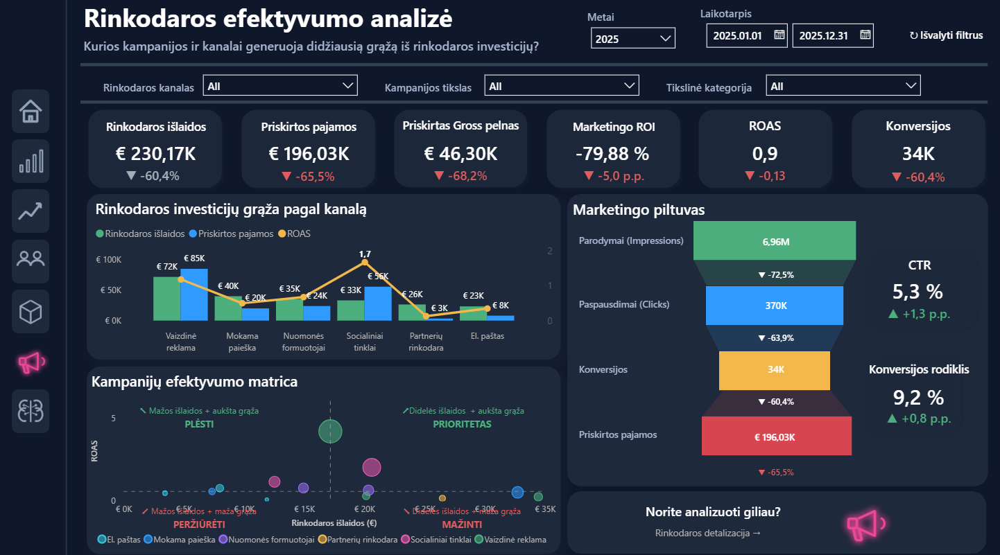

Campaign performance can be analysed using several selectable metrics:

- ROAS
- Attributed Revenue
- Attributed Gross Profit
- Marketing Spend

The analysis can be expanded through the decomposition tree to understand which channels, campaign objectives, target categories, and individual campaigns drive marketing results.

A detailed campaign table provides campaign-level profitability and conversion metrics.

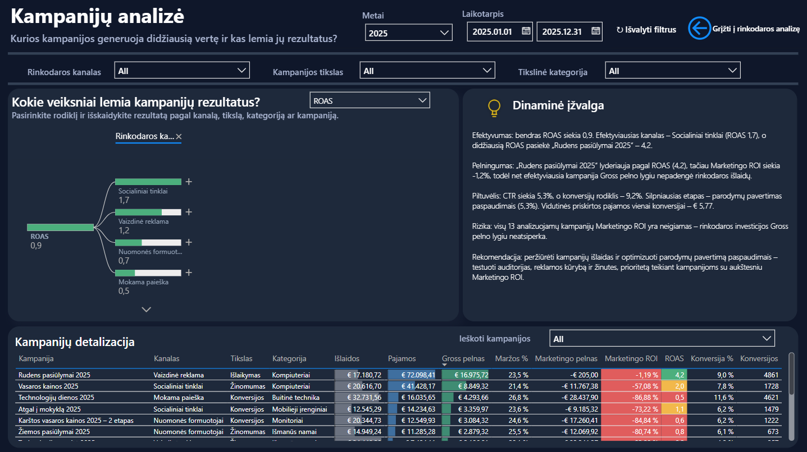

---

## Forecasting & Scenario Analysis

The Forecasting & Scenario Analysis section combines multiple forecasting approaches with interactive what-if modelling.

The report includes several selectable revenue forecasting models:

- Data Forecast
- Baseline (LY)
- Historical Monthly Average
- Short-Term Trend (3M)
- Long-Term Trend (12M)

Forecast accuracy is evaluated using **MAPE (Mean Absolute Percentage Error)**.

Users can also select the forecast horizon and compare forecasted results with budget.

Key forecast KPIs include:

- Revenue Forecast
- Gross Profit Forecast
- Gross Margin Forecast
- Contribution Profit Forecast
- Forecast Accuracy (MAPE)

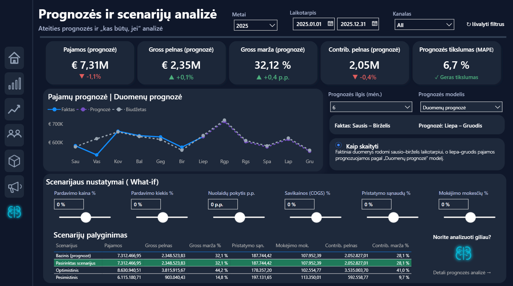

---

## What-If Scenario Modelling

Interactive What-If parameters allow users to simulate changes in:

- Selling Price
- Sales Volume
- Discount
- COGS
- Delivery Costs
- Payment Fees

The selected assumptions dynamically recalculate:

**Revenue → Gross Profit → Gross Margin → Contribution Profit → Contribution Margin**

The report compares:

- Baseline Forecast
- Selected Scenario
- Optimistic Scenario
- Pessimistic Scenario

This allows users to evaluate the potential financial impact of different business assumptions before making decisions.

---

## Forecast Detail

The Forecast Detail page provides deeper analysis of forecast performance, deviations, and risks.

It includes:

- Scenario result formation
- Monthly Actual/Scenario vs Budget comparison
- Forecast accuracy by business dimension
- Dynamic analytical insights

MAPE can be analysed by:

- Channel
- Country
- Category

This helps identify segments where the forecasting model performs well and areas where forecast reliability is lower.

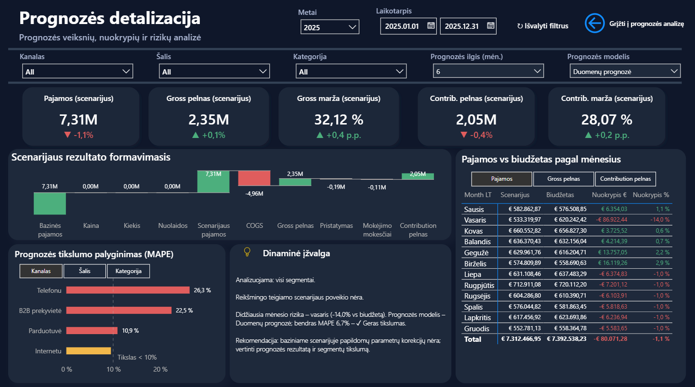

---

## Data Model

The project uses a dimensional data model with multiple fact tables connected to shared dimensions.

Main fact tables include:

- Fact_Sales
- Fact_Inventory
- Fact_Deliveries
- Fact_Returns
- Fact_Marketing
- Fact_Payments
- Budget_Forecast

Main dimensions include:

- Dim_Calendar
- Dim_Product
- Dim_Customer
- Dim_Store
- Dim_Region
- Dim_Channel
- Dim_Campaign
- Dim_Supplier
- Dim_Employee

The model separates different business processes into dedicated fact tables while using shared dimensions for consistent filtering and analysis.

### Sales Model

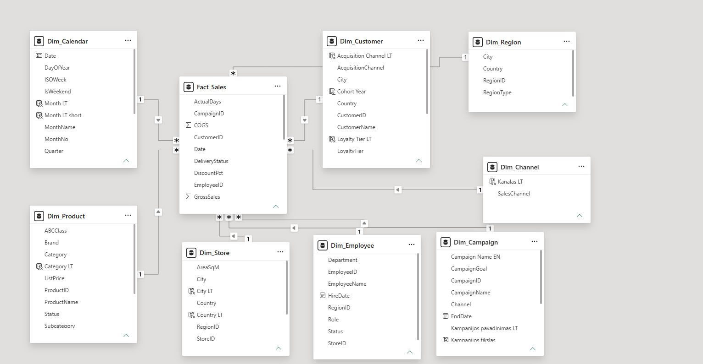

### Inventory Model

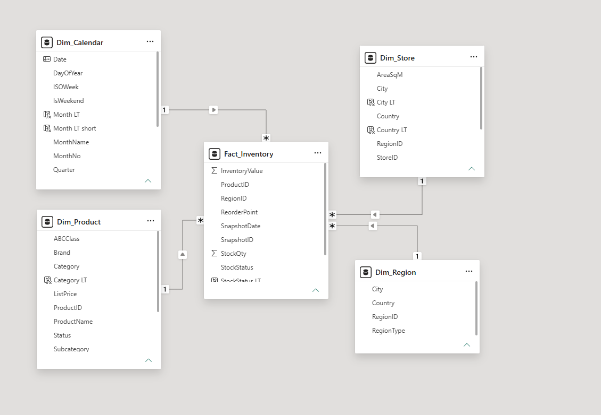

### Deliveries Model

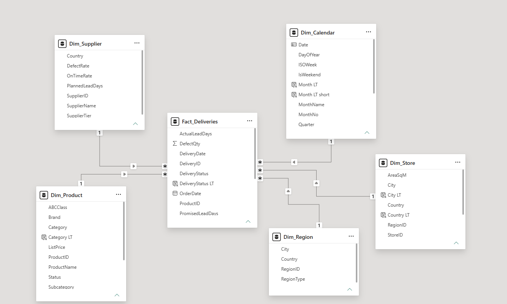

### Returns Model

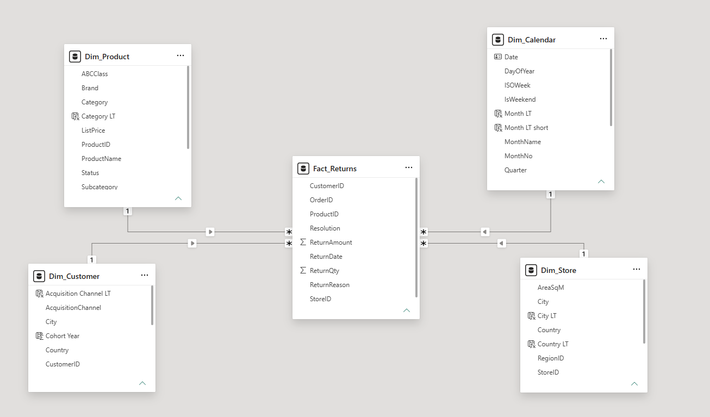

### Marketing Model

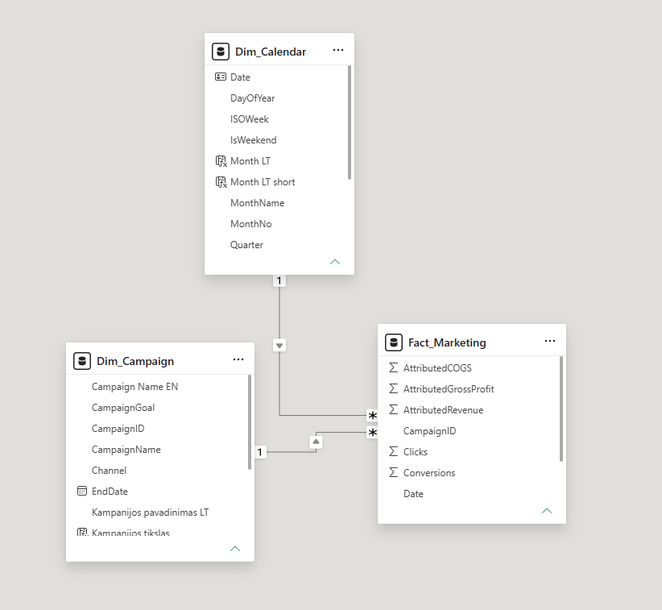

### Payments Model

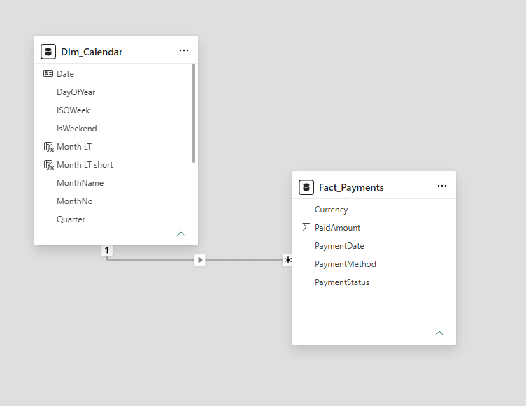

### Budget & Forecast Model

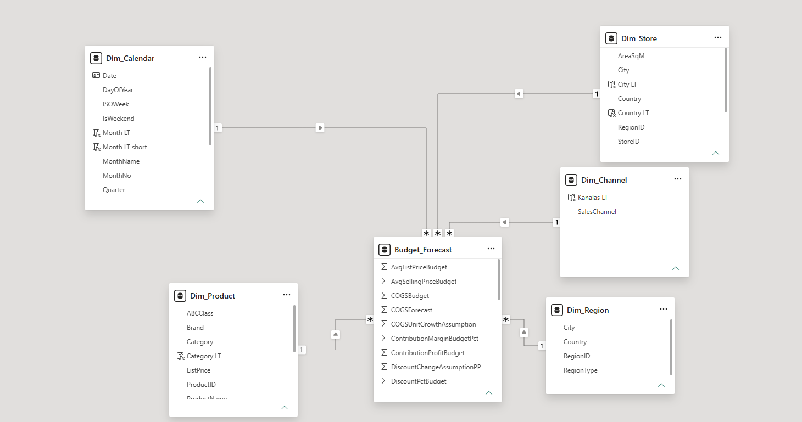

---

## DAX Measure Organisation

Measures are organised into dedicated folders to keep the semantic model structured and easier to maintain.

Main measure groups:

- 00 Core Measures
- 01 Time Intelligence
- 02 Budget & Forecast
- 03 Executive Summary
- 04 Sales Analysis
- 05 Customer Analytics
- 06 Profitability
- 07 Inventory & Supply
- 08 Marketing

This structure separates reusable core calculations from business-specific analytical measures.

---

## Key Power BI Techniques

The project demonstrates the use of:

- Power Query
- DAX measures
- Time Intelligence
- Budget vs Actual analysis
- Year-over-Year analysis
- Price / Volume / Mix analysis
- Field Parameters
- What-If Parameters
- Dynamic KPI cards
- Dynamic titles
- Conditional formatting
- Decomposition Trees
- Cohort Analysis
- RFM Segmentation
- Forecast Backtesting
- MAPE
- Dynamic analytical narratives
- Interactive drill-down analysis

---

## Business Questions Addressed

The report is designed to answer questions such as:

- Are revenue and profit growing compared with last year?
- Are revenue and profit targets being achieved?
- What is driving changes in revenue?
- Which countries, stores, categories, and products drive performance?
- Is profitability improving or deteriorating?
- Which customers generate the highest value?
- Which customer groups are at risk?
- Are inventory levels appropriate?
- Which products face stock shortage or excess inventory risk?
- Are suppliers delivering on time?
- Which marketing channels and campaigns generate the best return?
- How accurate are the forecasts?
- What could happen if price, volume, discounts, or costs change?

---

## Tools

- Power BI Desktop
- Power Query
- DAX
- Excel / CSV data sources

---

## Author

**Renata Dzetlauskienė**

Power BI / Data Analytics Portfolio Project
